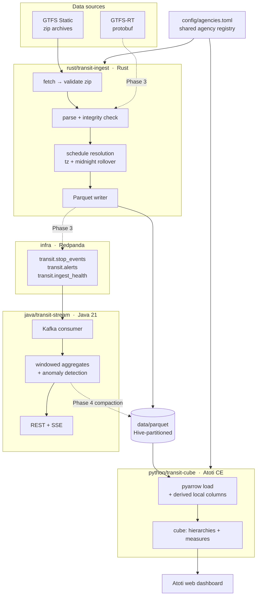

# Transit Delay Explorer

A polyglot analytics platform over public transit data: Rust ingests and
transforms GTFS, Java runs the real-time streaming layer, and Atoti (Python
Community Edition) provides the OLAP cube and dashboard.


---

## Why this matters

Every transit agency publishes two feeds: a static timetable (GTFS Static) and a
real-time stream of where the vehicles actually are (GTFS-RT). Almost nobody
joins them. Riders get a "next train in 4 minutes" number and no way to ask
whether their line is *usually* late at 8am on a Tuesday, and analysts get raw
CSV archives that are, on inspection, harder to use than they look:

- `route_id` `1` names three unrelated railroads across the MTA's three feeds,
  and 104 `stop_id` values are shared between agencies — so the obvious join is
  wrong, and wrong *silently*.
- Two of the three feeds ship no `calendar.txt` at all, only
  `calendar_dates.txt`, so "which days does this trip run" has three different
  answers depending on the feed.
- 2.5–3.4% of all stop times are past `24:00:00` (`25:14:00` means 1:14am the
  *next* calendar day, still counted against the previous service date), with
  hours as high as 28. Treat that as an edge case and you quietly misfile every
  overnight train.

Each of those turns a plausible-looking dashboard into a wrong one. This project
takes the position that the hard part of transit analytics is not the modelling
but the data contract: resolve the schedule correctly, namespace the keys, get
the service-date semantics right, and then a cube on top of it can answer
"delay by borough by service period by day type" without a caveat.

The findings that changed the schema were made by downloading the real archives
and reading them *before* any parsing code was written; they are recorded in
[`docs/FEED_NOTES.md`](docs/FEED_NOTES.md).

## Skills demonstrated

**Rust** — a CLI + library crate (`clap` derive, `tracing`/`EnvFilter`), CSV
parsing with `csv` + `serde` and `Option<T>` for GTFS's genuinely optional
fields, streaming zip extraction, `chrono`/`chrono-tz` for timezone- and
DST-correct instant resolution, `thiserror` error enums with one variant per
failure mode, and Arrow `RecordBatch` construction written straight to
zstd-compressed Parquet via `arrow` + `parquet` 53. 129 unit tests in-tree.

**Java** — Spring Boot 3.3 on Java 21: records as the domain model, Spring Kafka
consumers, Actuator (health/metrics/Prometheus), virtual threads enabled for the
SSE endpoint's thread-per-subscriber workload, `@ConfigurationPropertiesScan`
for typed config, and `t-digest` for bounded-memory streaming percentiles.

**Python** — Atoti Community Edition cube design (manual-mode cube, hierarchies,
dimension assignment, derived and aggregated measures), `pyarrow.dataset` with
an explicitly declared Hive partitioning schema, pandas dtype work at the
Atoti seam, `tomllib` config sharing with the Rust side, `StrEnum` domain types,
`ruff` lint + format, pytest.

**Data engineering** — dimensional modelling (star schema, composite surrogate
keys, ragged hierarchies), Hive-style partitioning and partition pruning,
referential-integrity validation as a build gate, schema-first design so a
Phase 5 data swap needs no cube rework.

**Platform** — Docker Compose with healthchecks, service profiles, and a
one-shot idempotent topic initializer; Redpanda as a Kafka-wire-compatible
broker; a four-job GitHub Actions matrix (Rust fmt/clippy/test, Maven verify,
ruff + pytest, and a real broker produce/consume round trip).

## Architecture

Two paths, deliberately. The **live path** runs through Kafka into the Java
service for sub-minute state. The **historical path** runs through partitioned
Parquet into the cube for deep slicing. They meet in the dashboard.



Dotted edges are the phases not yet built — see [Status](#status).

### Repository layout

```
config/agencies.toml     The whole agency registry: feed URLs, timezone,
                         per-agency realtime quirks, shared defaults.
                         Read by BOTH the Rust ingest and the Python cube.

rust/transit-ingest/     Library + thin CLI (`transit-ingest`)
  src/config.rs            registry types, namespaced key construction
  src/fetch.rs             download static archives, validated before landing
  src/gtfs/                archive.rs, records.rs, time.rs, calendar.rs, validate.rs
  src/schedule.rs          stop_times → trips → service dates → absolute instants
  src/dataset/             facts.rs, dimensions.rs, write.rs (Arrow → Parquet)

contracts/               The wire contract between the two halves.
  stop_event.json          golden `transit.stop_events` message, snake_case,
                           parsed by BOTH the Rust and the Java test suites.

java/transit-stream/     Spring Boot 3.3 / Java 21
  .../TransitStreamApplication.java   entrypoint (scheduling enabled)
  .../domain/StopEvent.java           the wire record shared with the ingest
  resources/application.yml           topics, windows, thresholds, Parquet dir

python/transit-cube/     Atoti Community Edition
  src/transit_cube/config.py     reads config/agencies.toml
  src/transit_cube/calendar.py   day-type + service-period classifiers
  src/transit_cube/dataset.py    pyarrow load, partition schema, derived columns
  src/transit_cube/cube.py       tables, joins, hierarchies, measures
  src/transit_cube/serve.py      `python -m transit_cube.serve` entrypoint
  Dockerfile                     pins 3.11; Atoti CE does not support 3.13

infra/
  docker-compose.yml       Redpanda + console + topic-init + cube (profile)
  scripts/create-topics.sh idempotent topic creation
  scripts/smoke-test.sh    produce/consume round trip

data/                    Feeds and generated Parquet. Gitignored.
docs/                    DATA_MODEL.md, FEED_NOTES.md, WORKPLAN.md
```

### Why each language sits where it does

| Layer | Language | Why |
| --- | --- | --- |
| Ingest | Rust | Millions of `stop_times` rows per feed, parsed and resolved to absolute UTC instants. The work is CPU- and IO-bound with no runtime to warm up, `arrow`/`parquet` are first-class, and the type system does real work here: GTFS's optional fields become `Option<T>` so an absent `route_short_name` cannot be mistaken for an empty one. |
| Streaming | Java | The Kafka ecosystem's centre of gravity, and Java 21's virtual threads fit an SSE endpoint that holds a thread per subscriber for the life of the subscription. Sketch libraries (t-digest) for streaming percentiles are mature here. |
| Cube | Python | Atoti's API *is* Python. pandas/pyarrow also make the Parquet seam trivial, which matters because the fact table needs two agency-local columns derived at load time that cannot exist in the file. |

### Models

**Data model** — a star schema. Full detail in
[`docs/DATA_MODEL.md`](docs/DATA_MODEL.md).

*Fact table* `scheduled_events`, one row per scheduled call at one stop,
partitioned by `service_date`:

| Column | Type | Note |
| --- | --- | --- |
| `event_id` | utf8 | stable hash of agency + trip + stop + service date |
| `agency_id`, `route_id`, `route_key`, `trip_id`, `stop_id`, `stop_key` | utf8 | `*_key` are the namespaced `{agency_id}:{id}` join keys |
| `stop_sequence` | int32 | |
| `direction_id` | int32, nullable | GTFS makes it optional; not defaulted to 0 |
| `scheduled_arrival`, `scheduled_departure` | timestamp(µs, UTC) | |
| `dwell_seconds` | int32 | |
| `crosses_midnight` | bool | GTFS time was ≥ `24:00:00` |
| `actual_arrival`, `delay_seconds`, `headway_seconds`, `is_cancelled`, `vehicle_id` | nullable | realtime columns — **typed nulls today**, filled in Phase 3 |

`service_date` is deliberately **not** a column: it lives in the directory name
only. Writing it in both places makes every partition-aware reader fail the
whole dataset with `Field service_date has incompatible types: date32[day] vs
string`. Readers recover it as a real date by declaring the partition schema,
which `transit_cube.dataset` does.

*Dimensions* — `routes` (`route_key`, mode, `route_type`, short/long/display
name, colour) and `stops` (`stop_key`, name, lat/lon, `is_station`,
`parent_station_key`, `station_key`, `borough`, `municipality`), both written by
the ingest. `calendar` (`service_date`, `day_type`, `is_holiday`, year, month,
`day_of_week`) is not on disk at all — it is built in Python *from the service
dates the facts actually contain*, so the dimension cannot disagree with the
fact table about which days exist.

*Cube model* (`transit_cube.cube`, Atoti in `manual` mode so levels are opted
into rather than one hierarchy per column):

| Hierarchy | Built from | Levels |
| --- | --- | --- |
| Geography | `stops` | borough → municipality → station → platform (`stop_id`) |
| Network | `routes` | agency → mode → route display name |
| Direction | `scheduled_events` | `direction_id` |
| Calendar | `calendar` | year → month → service date |
| Day Type | `calendar` | Weekday / Weekend / Holiday |
| Service Period | `scheduled_events` | AM Peak / Midday / PM Peak / Evening / Overnight |
| Hour of Day | `scheduled_events` | agency-local hour |

`Service Period` and `Hour of Day` are reassigned to a `Time` dimension and
`Direction` to `Network`; without that, every fact-table hierarchy would land in
a dimension named after the table and the UI would offer them under
`scheduled_events` rather than next to the calendar. There is no `line` level:
GTFS has no concept of one, the MTA's own "lines" are an editorial grouping that
appears in no feed, and inventing one from route names would be a guess
presented as data.

Measures: Scheduled Stops, Scheduled Trips, Routes Served, Stops Served,
Service Days, Trips per Service Day, Stops per Trip, Mean Dwell Seconds,
Overnight Stops, Overnight Share. Every one is a **schedule** measure —
percentiles and on-time performance need the realtime columns and arrive in
Phase 5 against this same schema, which is the whole reason the cube is built
this early: an awkward hierarchy costs an edit now and a rewrite later.

*Classification models* (`transit_cube.calendar`) are deliberately rule-based
pure functions rather than learned: `classify_day_type` (holiday wins over
weekend, from a published federal-holiday set — the holiday schedule is an
operational decision an agency publishes, not something derivable), and
`classify_service_period` over half-open agency-local hour bounds, accepting
GTFS hours `0..47`. *Statistical models* enter with the streaming layer:
t-digest sketches for bounded-memory delay percentiles, and anomaly detection
comparing a window's mean delay against the historical baseline for the same
day-of-week and hour (`tde.anomaly.threshold-seconds`, with a
`min-observations` floor below which a window is too thin to judge).

Three structural constraints shaped all of the above, and all three were forced
rather than chosen:

- **Every join key is namespaced.** `route_id` `1` names three unrelated
  railroads, so joins are on `{agency_id}:{id}`, never the bare id.
- **One vocabulary on the wire and on disk.** `transit.stop_events` messages are
  snake_case, matching the Parquet columns, pinned by the golden fixture in
  [`contracts/`](contracts/README.md) that both test suites parse. The Java
  record's components stay camelCase and are mapped; a producer and a consumer
  disagreeing about a field name is the one kind of break that shows up as
  plausible nulls rather than as an error.
- **A hierarchy cannot span tables.** Atoti builds each from one table's
  columns, which splits calendar time in two: the date levels belong to the
  calendar dimension, the hour to the fact row. They are exposed as `Calendar`
  and `Hour of Day` rather than faked into one hierarchy.
- **A hierarchy level cannot be null.** Hence `Unknown` defaults rather than
  nulls, `direction_id` defaulting to `-1` rather than `0`, and — because only
  the Subway models stations as parents of platforms (496 stations, 992
  platforms) while LIRR and Metro-North are flat — a parentless stop being
  emitted as its own station so the ragged geography hierarchy stays walkable
  across agencies.

## How it works

1. **Registry.** `config/agencies.toml` is the single source of truth: three MTA
   agencies (NYC Subway, LIRR, Metro-North), their static archive URLs, their
   GTFS-RT endpoints, timezone, and per-agency quirks (NYCT realtime `trip_id`s
   carry a schedule-run prefix and match on the suffix; NYCT realtime `stop_id`s
   append an N/S direction suffix). Adding an agency is an entry here, not a
   code change. Both the Rust ingest and the Python cube read this file.

2. **Fetch** (`transit-ingest fetch`). Downloads each static archive to
   `data/raw/<agency>.zip`, keeping one it already has — the static feeds change
   a few times a year — unless `--force`. A download is validated as a zip
   holding the required GTFS files *before* it replaces anything on disk: the
   MTA serves an HTML error page with a 200 status when a feed is briefly down,
   and letting that land as `MTA_NYCT.zip` turns a network blip into a parse
   error days later that names entirely the wrong cause.

3. **Parse and validate** (`gtfs/`). Streaming zip read, `csv` + `serde` row
   types with optional fields as `Option<T>` and unknown columns ignored rather
   than fatal (LIRR's `routes.txt` has neither `agency_id` nor
   `route_short_name`). `ServiceCalendar` resolves service dates from
   `calendar.txt`, `calendar_dates.txt`, or both-with-override. `validate::check`
   reports *every* referential-integrity violation rather than stopping at the
   first, so fixing a feed is not an N-round trip.

4. **Resolve the schedule** (`schedule.rs`). The join GTFS leaves to the
   reader: `stop_times → trips → service_id → service dates`, then each GTFS
   time resolved against each date in the agency timezone. Per the spec, times
   are measured from *noon minus twelve hours* on the service date, not from
   midnight — on a DST transition day those differ by an hour, and noon is
   always unambiguous. Resolution is per service date (a week of Subway service
   is millions of events; materialising a whole feed at once is gigabytes for no
   benefit) and the expensive `stop_times`-by-trip index is built once.

5. **Write** (`dataset/`). Arrow `RecordBatch` → zstd Parquet, Hive-partitioned,
   one file per agency per date so re-ingesting the Subway never rewrites a file
   that also holds LIRR rows:

   ```
   data/parquet/
     scheduled_events/service_date=2026-07-27/MTA_NYCT.parquet
     routes/MTA_NYCT.parquet
     stops/MTA_NYCT.parquet
   ```

   `build` refuses to write a feed with integrity violations unless given
   `--allow-violations`, since a dataset with dangling keys becomes a cube with
   silently missing slices. When several agencies are built together the default
   window is the **intersection** of their coverage, not the union: the three
   MTA feeds are published on their own schedules and taking each feed's own
   first week gives the Subway late May, Metro-North mid-July and the LIRR the
   end of July, with not one day in common — and nothing looks wrong until you
   slice by agency and one of them is empty.

6. **Load** (`transit_cube.dataset`). `pyarrow.dataset` with the partitioning
   schema declared explicitly, pruning at the partition level when
   `TDE_CUBE_DATES` restricts the load. Two columns are derived here because
   they cannot exist in the file: `local_hour` (facts are UTC; slicing on the
   UTC hour would put a New York rush-hour train in the middle of the night) and
   `service_period`, both per-agency-timezone. Day type comes from the
   *partition* date, not the timestamp — a 25:30 train arrives at 01:30 the next
   morning but belongs to the previous day's service.

7. **Cube** (`transit_cube.cube`). Four session tables joined on the namespaced
   keys, hierarchies and measures defined, served by
   `python -m transit_cube.serve` with dashboards persisted to
   `TDE_CUBE_CONTENT`.

8. **Live path** (Phases 3–4, scaffolded). The realtime poller diffs consecutive
   GTFS-RT polls, joins against the static schedule to compute `delay_seconds`,
   and produces to `transit.stop_events` — partitioned by route so the Java
   service's per-route windows stay on one consumer instance and need no
   cross-partition coordination. `transit-stream` consumes those into rolling
   5m/1h/24h aggregates, serves REST + SSE, and flushes completed windows back
   to the shared Parquet volume on a cron for the cube to pick up.

## How to run

### Prerequisites

- **Docker** with Compose — the only strict requirement; the Java and Python
  toolchains can run containerized.
- **Rust** 1.82+ (`rust-version` in the workspace manifest) for the ingest.
- Optional: **Maven** + **JDK 21** for the Java service, **Python 3.11 or 3.12**
  (`requires-python = ">=3.11,<3.13"` — Atoti CE does not support 3.13) for a
  non-container cube.

Run every command from the repository root unless noted.

### 1. Bring up the broker

```bash
docker compose -f infra/docker-compose.yml up -d   # broker + console + topics
bash infra/scripts/smoke-test.sh                   # produce/consume round trip
```

Redpanda console at <http://localhost:8090>; Kafka API on `localhost:19092`
from the host and `redpanda:9092` from inside the network; Schema Registry on
`18081`, admin/metrics on `19644`.

### 2. Ingest a dataset

```bash
cd rust
cargo run --release --bin transit-ingest -- fetch            # download archives
cargo run --release --bin transit-ingest -- build --days 7   # write the dataset

cargo run --bin transit-ingest -- agencies                   # list the registry
cargo run --bin transit-ingest -- inspect MTA_NYCT           # contents + integrity
```

`build` takes an optional agency id, `--from` / `--to` for an explicit window,
or `--days N` for N days from the start of the window, plus `--archive <path>`
and `--allow-violations`. `fetch` takes `--force`. `inspect` exits non-zero on
integrity violations, so it is usable as a gate.

### 3. Serve the cube

```bash
docker compose -f infra/docker-compose.yml --profile cube up --build cube
```

Dashboard at <http://localhost:9090>. It is behind a profile because it is not
part of the broker stack — `up -d` on its own still starts only Redpanda. The
repo is mounted read-only, so changing a measure is an edit and a restart rather
than an image rebuild; saved dashboards live in a volume and survive one.

### Configuration

| Variable | Consumer | Meaning |
| --- | --- | --- |
| `TDE_CONFIG` | ingest | Agency registry path. Default `config/agencies.toml`. |
| `TDE_DATA_DIR` | ingest, cube | Working directory. Ingest defaults to `data`; the cube reads `<TDE_DATA_DIR>/parquet` and, unset, walks up to find `data/parquet`. |
| `TDE_LOG` | ingest | `tracing` env-filter. Default `info`. |
| `TDE_CUBE_PORT` | cube | Port Atoti serves on. Default `9090`. |
| `TDE_CUBE_HOST_PORT` | compose | Host-side port for the cube — 9090 is also Prometheus's default. |
| `TDE_CUBE_DATES` | cube | Comma-separated `YYYY-MM-DD` service dates to load. Prunes at the partition level: seconds instead of minutes on a full window. |
| `TDE_CUBE_CONTENT` | cube | Writable path for saved dashboards. Compose gives it a volume. |
| `TDE_KAFKA_BOOTSTRAP` | stream | Default `localhost:19092`. |
| `TDE_STREAM_PORT` | stream | Default `8080`. |
| `TDE_PARQUET_DIR` | stream | Shared Parquet volume. Default `/data/parquet`. |

Non-environment settings — topics, window sizes, the on-time threshold, anomaly
thresholds, the compaction cron — live in
`java/transit-stream/src/main/resources/application.yml`; poll interval,
staleness bound, request timeout and per-agency quirks live in
`config/agencies.toml`.

### Tests

```bash
# Rust
cd rust && cargo fmt --all -- --check && cargo clippy --all-targets -- -D warnings && cargo test

# Java
cd java/transit-stream && mvn verify
# ...or without a local Maven:
docker run --rm -v "$PWD:/app" -w /app maven:3.9-eclipse-temurin-21 mvn -B verify

# Python
cd python/transit-cube && pip install -e ".[dev]" && ruff check src tests && pytest

# ...or containerized, which is the only form that runs the Atoti cube tests
docker build -t tde-cube:latest python/transit-cube
docker run --rm -v "$PWD:/app:ro" -w /app/python/transit-cube tde-cube:latest pytest
```

`tests/test_cube.py` skips itself where Atoti is absent, so CI runs the calendar,
config and loader tests on a plain pandas/pyarrow install and covers the cube in
the container instead. The loader tests write their own fixture dataset, so no
ingest run is required.

## Status

Built in phases; see [`docs/WORKPLAN.md`](docs/WORKPLAN.md).

- [x] Phase 0 — Foundations: monorepo, broker, topics, verified round trip
- [x] Phase 1 — Rust static ingest: fetch, parse, validate, resolve, and write a
  partitioned Parquet dataset for a service week
- [x] Phase 2 — Atoti cube v1: the schema, hierarchies and schedule measures,
  on static data and before any streaming is built on top of them
- [ ] Phase 3 — Rust realtime ingest
- [ ] Phase 4 — Java streaming service (scaffolded: entrypoint, the `StopEvent`
  domain record, and the topic/window/threshold configuration)
- [ ] Phase 5 — Cube v2, the real measures
- [ ] Phase 6 — Polish, synthetic generator, load test

## Data source

The free MTA feeds — NYC Subway, LIRR, and Metro-North — across two transit
modes. The system is agency-agnostic: adding an agency is a config entry, not a
code change.

## Licensing note

No paid licenses anywhere in the stack. Atoti Community Edition's free license
expires periodically and requires updating to a current release, and it reports
telemetry — this project is not intended to run untouched for months.

## License

MIT — see [LICENSE](LICENSE).
